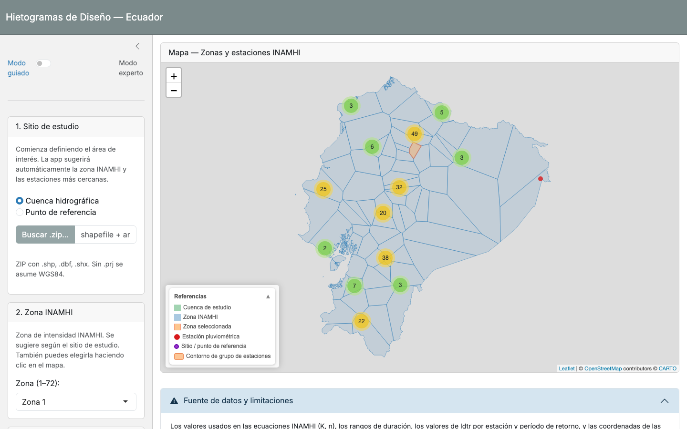
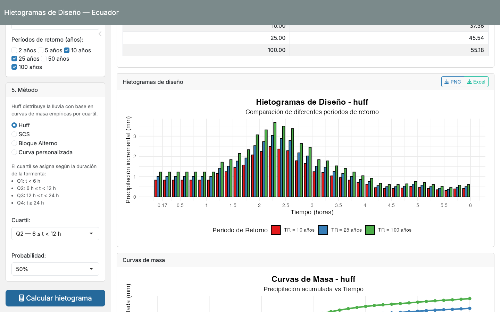

# Hietogramas de Diseño — Ecuador

**Generador de hietogramas de diseño con las curvas IDF oficiales del INAMHI, con cobertura de las 72 zonas de intensidad del país.**

🔗 **Demo en vivo:** próximamente (en proceso de despliegue)

Antes de esta herramienta, armar un hietograma de diseño en Ecuador significaba abrir el PDF del estudio de lluvias intensas del INAMHI, ubicar a mano la zona y la estación de referencia, transcribir los coeficientes K y n a una hoja de Excel armada por el propio ingeniero, y repetir el proceso para cada período de retorno y cada método por separado. Un trabajo propenso a errores de transcripción, difícil de auditar, y que tomaba horas para un solo punto de diseño.

Esta app reduce ese trabajo a minutos: elegís una cuenca o un punto de coordenadas sobre el mapa, la aplicación sugiere automáticamente la zona INAMHI y las estaciones pluviométricas más cercanas, y devuelve la tabla de precipitación, las ecuaciones aplicadas y el hietograma final — listo para descargar en PNG o Excel.



## Qué hace

- **Cobertura nacional**: las 72 zonas de intensidad INAMHI y 220 estaciones pluviográficas.
- **3 métodos de hietograma estándar** — Huff (por cuartil), SCS (tipos I / IA / II / III) y Bloque Alterno — más soporte para curvas de distribución temporal personalizadas.
- **Exploración espacial integrada**: cargá una cuenca (shapefile) o marcá un punto en el mapa; la app pondera las estaciones con Thiessen, IDW o promedio simple según lo que tengas disponible.
- **Selección de zona y estaciones asistida**: sugerencia automática por proximidad, con ajuste manual clic a clic sobre el mapa.
- **Resultados listos para reporte**: ponderación de estaciones, ecuaciones INAMHI en notación matemática, gráficos de hietograma y curva de masa, exportables a PNG y Excel.
- **Modo guiado / modo experto**: la misma herramienta sirve para quien está aprendiendo el método y para quien solo necesita el número rápido.



## Stack técnico

- **R** para el motor de cálculo, con 250 tests automatizados (`testthat`) cubriendo las fórmulas INAMHI, la ponderación espacial y los métodos de hietograma.
- **Shiny + bslib** para la interfaz.
- **sf + leaflet** para el componente espacial (Thiessen, IDW, mapa interactivo).
- **ggplot2** para los gráficos y **writexl** para la exportación a Excel.

## Por qué esto importa

Las herramientas comerciales de hidrología tienen licencias que muchos consultores independientes, ONGs y estudiantes en Ecuador no pueden costear. Esta app pone el mismo cálculo — calibrado específicamente para la normativa ecuatoriana, no una aproximación genérica — al alcance de cualquiera con un navegador, en minutos en vez de horas, y sin el riesgo de errores de transcripción manual de tablas.

<details>
<summary><strong>Instalación y desarrollo local</strong></summary>

```r
install.packages(c(
  "shiny", "bslib", "shinyjs", "ggplot2", "writexl",
  "sf", "leaflet", "testthat", "googlesheets4"
))

# Correr la app
shiny::runApp()

# Correr los tests del motor de cálculo
Rscript tests/run_tests.R
```

</details>

---

**Contacto:** christiang.dominguezg@gmail.com
